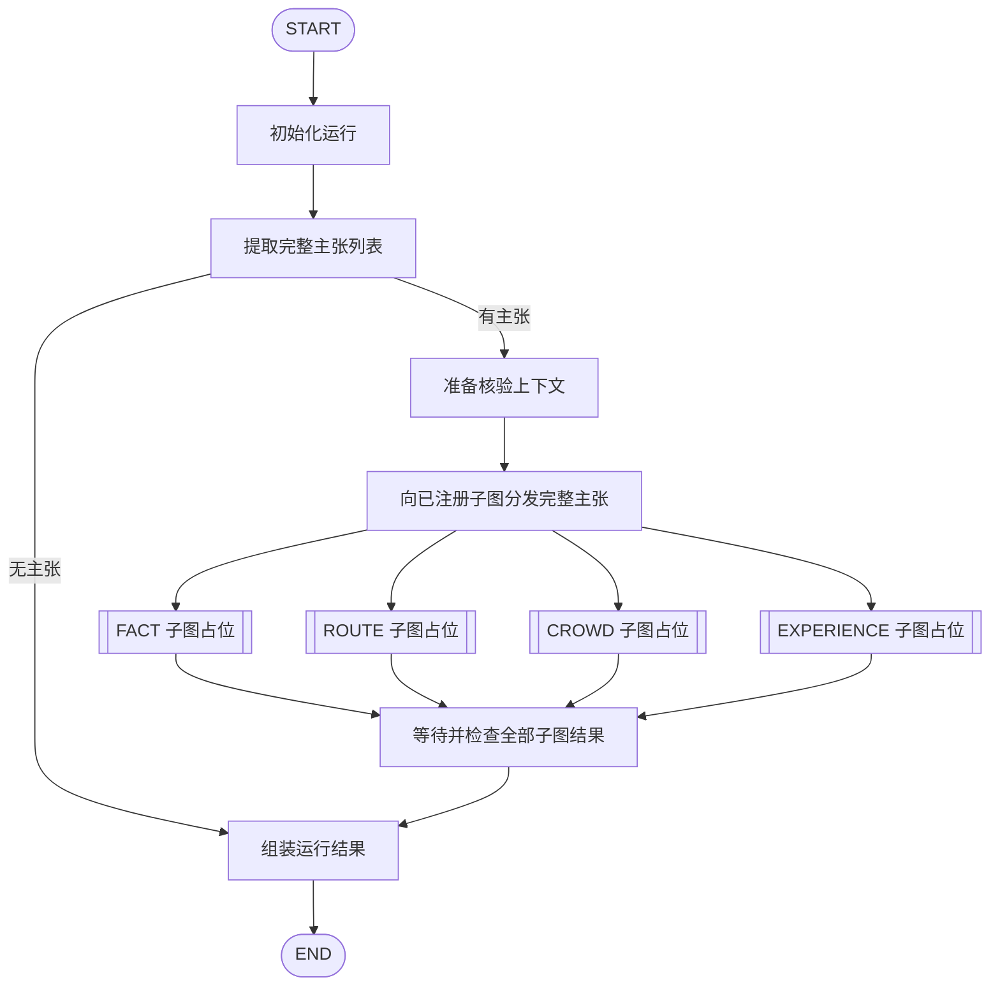

# 旅行信息核验主图框架

主图采用 LangGraph，复用已有材料提取流程，将完整 Claim 列表交给各类别子图，等待全部子图返回后汇总运行结果。当前实现的是编排框架；类别核验、逐主张结论、用户报告和真实证据来源仍为扩展位置。

## 主张与子图的关系

主图接收用户材料，提取节点一次得到完整主张列表。主图向所有已注册子图传递独立副本，由各子图自行选择需要处理的主张，并管理内部任务。

一条主张可以被多个子图选择，每个子图也可以针对同一主张返回多项发现。Claim.type 保留现有提取模型的主要分类，主图不使用这个字段过滤子图输入。任务拆分、检索策略及子图之间如何使用信息，留待具体类别设计。

扩展子图只需加入注册表。新增 Claim 类型时仍需更新提取模型和提示词，但主图拓扑、分发逻辑与 State 无需按类型增加分支。

## 流程



代码中通过 Send 向 run_subgraph 节点分发子图名称和完整输入。该节点等待对应子图执行完成，再返回单项状态更新；并行结果由 reducer 按名称合并。collect_results 在各分支汇合后检查结果完整性，再进入 assemble_result。注册表为空时直接组装结果。

## State 与运行时依赖

| State 字段 | 内容 |
| --- | --- |
| request | 用户原始地点、文字、链接和图片标识 |
| run_id | 本次运行标识 |
| stage | 初始化、提取、上下文准备、汇合和结束阶段 |
| claims | 提取出的完整主张列表，后续节点保留原文与来源 |
| context | 目标地点、本次核验时间和可选的解析地点 |
| subgraph_results | 按子图名称合并的执行结果 |
| result | 汇总后的 VerificationRun |

图片 bytes 只在提取模块调用 Agent 时使用。浏览器、存储连接、模型客户端和证据来源通过构造函数或 LangGraph runtime context 注入，不写入 State。

VerificationCapabilities 预留 place_resolver 和 evidence_sources。地点解析尚未接入时，resolved_place 为 None，不能视为已经确认具体 POI。默认来源注册表包含 web_search 占位；调用它会明确提示供应商尚未接入。可以通过同一 EvidenceSource 接口注入 Web Search 实现或其他来源，当前不设计查询、排序与证据核验策略。

## 节点职责

| 节点 | 职责 |
| --- | --- |
| initialize | 生成运行标识、核验时间，初始化结果集合 |
| extract_claims | 调用提取模块，读取图片、执行 Agent、校验来源并统一编号 |
| prepare_context | 使用可选地点解析依赖准备上下文；默认保留用户地点名称 |
| run_subgraph | 为每个已注册子图传递全部主张与上下文，限制执行时间，校验返回引用 |
| collect_results | 检查每个已注册子图都有结果，完成汇合 |
| assemble_result | 组装内部运行结果与执行状态；逐主张评估和用户报告由后续实现补充 |

提取或共享上下文阶段的错误继续交给原有 HTTP 错误映射处理。子图异常、无效引用或超时转换为该子图的 failed 结果，其他分支继续完成。取消整个运行会向上传播。

## 子图接口

每个子图是编译后的 LangGraph，接收 SubgraphState 中的 claims 和 context，通过 result 字段返回 SubgraphResult。需要证据等能力时，从 Runtime[VerificationCapabilities] 获取依赖。

| 输出字段 | 含义 |
| --- | --- |
| graph_name | 子图注册名称 |
| status | completed、skipped、not_implemented 或 failed |
| selected_claim_ids | 子图自行选择的主张标识 |
| findings | 与所选主张关联的多项发现，每项可携带证据 |
| notes | 说明和信息缺口 |
| error | 执行失败原因 |

同一 claim_id 可以出现在多个子图和多项 Finding 中。主图校验引用属于本次提取结果，且 Finding 属于子图选择的主张。材料来源 Claim.sources 与核验来源 Evidence 分别保存。

默认四个子图只包含 pending 节点，返回 not_implemented，不筛选主张、不检索、不产生发现或真假结论。后续类别实现通过注册表替换占位子图，内部可扩展自己的 State。

VerificationRun.status 描述执行情况：无主张为 no_claims；全部占位或无注册图为 not_implemented；全部执行完成或跳过为 completed；全部失败为 failed；混合完成、未实现和失败状态为 partial。completed 不表示所有主张已获证据支持。当前没有定义最终 Verdict 的判断策略。

## 模块组织

```text
backend/
  main.py                         # 组装存储、提取函数、子图注册表和运行时依赖
  api/
    routes.py                     # 文件上传与核验 HTTP 接口
    dto.py                        # HTTP 请求模型及字段校验
    error_handlers.py             # 异常到 HTTP 响应的映射及错误日志
  common/
    errors.py                     # 跨模块共享的业务异常，不依赖 FastAPI
  extraction/
    agent.py                      # browser-use 提取实现及配置读取
    models.py                     # Claim、Source、ClaimExtractionResult
    service.py                    # 图片读取、模型提取、来源校验和编号整理
  verification/
    service.py                    # 主图运行入口，解包并返回完整核验运行结果
    graph.py                      # 节点、拓扑、分发、汇合和结果组装
    state.py                      # State 及并行结果 reducer
    models.py                     # 地点上下文、证据、子图发现和运行结果
    capabilities.py               # 地点解析和证据来源扩展接口
    subgraphs/__init__.py          # 默认占位子图与注册入口
  storage/                        # 现有 SQLite 与本地图片存储
```

调用链为 API → VerificationService → 主图 → ClaimExtractionService → Repository 与 Agent；提取后主图调用注册子图并汇总。业务模型独立于 FastAPI 和 LangGraph，图框架相关 State 与编排放在 verification 模块。

Agent 位于 backend/extraction/agent.py，配置仍从 backend 目录读取，提示词仍从仓库根目录的 prompt.md 读取。HTTP 路由、请求 DTO 和错误处理位于 api 包，共享业务异常位于 common/errors.py。提取模型位于 extraction/models.py，verification/models.py 保留原有模型导出路径。

## 接口与扩展方式

沿用 POST /api/files 和 POST /api/verifications，请求字段保持不变。核验接口同步返回完整 VerificationRun，包含 run_id、context、claims、subgraph_results 和 status；地点位于 context.target_place。

VerificationService.run 接收 VerificationInput，调用主图后解包 GraphOutput.result，直接向调用方返回 VerificationRun。API 将 VerificationRequest 转为业务输入，并以 VerificationRun 作为响应模型。ClaimExtractionService.extract 返回的 ClaimExtractionResult 仅用于提取步骤和提取测试。前端展示完整运行结果及执行状态；逐主张真实性结论和用户报告仍待实现。

create_app 和 VerificationService 接受 subgraphs 注册表及 capabilities。subgraphs=None 使用默认四图；传入映射则替换默认注册表；传入空映射只执行提取及结果组装。新增图可以先取得 default_subgraphs()，再加入新名称。注册表在编译时复制，运行中保持稳定。

## 验证与注释

现有接口与服务测试覆盖图片持久化、材料顺序、来源校验、编号和空结果。新增主图测试使用真实 LangGraph 与脚本化依赖，验证全部主张分发、多项发现、新类别注册、并行汇合、分支数据隔离、失败与超时隔离、空主张短路以及运行时能力传递。

注释和 docstring 说明业务含义、输入输出、必要约束及行为原因，让未参与设计讨论的人能直接理解。占位能力必须明确说明未实现，不能返回伪造核验结论。

框架参考：[Graph API](https://docs.langchain.com/oss/python/langgraph/graph-api)、[子图通信](https://docs.langchain.com/oss/python/langgraph/use-subgraphs)。
