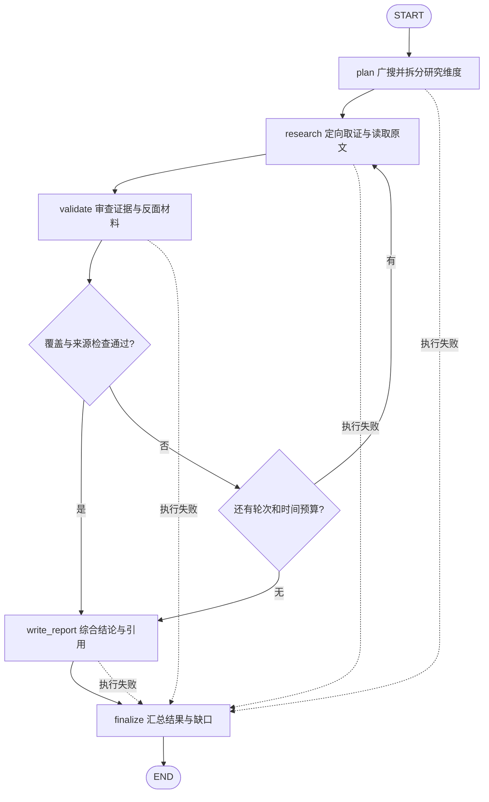

# DeerFlow 研究与核验状态机

基于 2026-10-05 读取的官方 `main` 提交 `e8f1e269e56d4865066f0b33e207d7c10e32ef12`，将 DeerFlow 2.x 的 `deep-research` Skill 整理为 LangGraph 设计草图，供后续自行实现。不引入 DeerFlow 依赖。

**实际结构**是 `create_agent` 创建的主代理，结合工具、middleware 和线程状态运行；需要时可以通过 `task` 委派子代理。研究阶段由 Skill 指导模型执行，在所读路径中没有独立的逐主张 `FactChecker` 节点。[主代理组装][agent]、[委派工具][task]

**下图是设计抽象**：将 Skill 的广泛探索、深入研究、多样性验证、综合检查显式拆成节点和条件边。它不是上游硬编码的研究图；逐项证据对照、结构化缺口和预算终止需要自行实现。[研究方法][skill]

## 1. 图结构

菱形表示条件边。`research` 根据 `gaps` 补搜；预算耗尽时报告必须保留未解决问题。上游 Skill 要求检查不通过就继续研究，但没有把这条回边或最大轮次写成研究专用图代码。[检查清单][skill]

## 2. State

**本项目对外接口已固定**：[SubgraphState](../../backend/verification/state.py) 接收完整的 `claims: list[Claim]` 和 `context: VerificationContext`，由子图自行选择主张；完成时返回包含 `result: SubgraphResult` 的状态。研究问题、维度、缺口和预算等属于内部状态。

下表的 `claims`、`context`、`result` 沿用本项目协议，其余为内部设计字段。DeerFlow 上游 `ThreadState` 保存消息、`todos`、`delegations`、`skill_context`、产物等通用运行状态，没有这里完整的研究与核验字段集合。[线程状态][state]

| 字段 | 内容 | 写入方 |
| --- | --- | --- |
| `claims` | 主图传入的完整 `Claim` 列表，保留主张 ID 与原始来源 | 主图 |
| `context` | 既有 `VerificationContext`：地点、核验时间、可选地点解析结果 | 主图 |
| `query` | 根据选中的主张和上下文生成的研究问题 | `plan` |
| `dimensions` | 子问题、研究角度及拟采用的查询 | `plan` |
| `sources` | 来源：`source_id`、`title`、`url`、`content` | `plan` / `research` |
| `findings` | 候选结论、关联 `source_ids`、适用条件与不确定性 | `research` / `validate` |
| `gaps` | 缺失证据、相互冲突的材料、待补充的反面视角 | `validate` |
| `coverage_ok` | 当前材料是否满足本次研究检查清单 | `validate` |
| `rounds` / `max_rounds` / `deadline` | 已执行研究轮次、轮次上限和共同截止时间 | `research` / 子图根据运行时配置初始化 |
| `report` | 带来源引用、冲突说明和未解决问题的报告 | `write_report` |
| `error` / `result` | 内部执行错误 / 既有 `SubgraphResult` | 各执行节点 / `finalize` |

主图只传入 `claims`、`context`，通过 runtime context 提供能力与配置；子图内部生成 `query`、初始化预算与 `rounds=0`。暂按顺序执行；若将研究维度并行派发，需另外设计来源去重和内部 `findings` 合并规则。

## 3. 节点职责

| 节点 | 读取 | 执行与写回 |
| --- | --- | --- |
| `plan` | `claims`、`context` | 选择主张、生成 `query`，广泛搜索并发现研究维度，写入 `dimensions`、初始 `sources`；对应 Skill 第一阶段 |
| `research` | 维度、已有来源、`gaps` | 按子问题或缺口定向搜索，读重要原文并追踪引用，更新 `sources`、`findings` 和轮次；对应第二阶段及迭代补搜 |
| `validate` | `findings`、`sources`、研究范围 | 检查数据、案例、专家观点、反面材料、时效和权威性；写入 `gaps`、`coverage_ok`，对应第三、四阶段。逐项对照结论与来源属于本草图增加的显式检查 |
| `write_report` | 材料、结论、缺口 | 综合报告并保留来源对应关系；有缺口就明确写出，不补造结论 |
| `finalize` | 报告、材料、缺口、错误 | 按主张 ID 整理 `ClaimFinding` 与 `Evidence`，写入 `SubgraphResult`；在备注中保留证据缺口和预算耗尽说明 |

广搜、深挖和检查清单来自 Skill；子代理重要结论需抽查，来自主代理提示词。上述节点名、引用关联结构及 State 写回契约由本草图定义。[Skill][skill]、[结果审查提示][prompt]

出口沿用[既有结果模型](../../backend/verification/models.py)：`status` 只能是 `completed`、`skipped`、`not_implemented`、`failed`；`selected_claim_ids` 来自输入，所有发现关联已选主张，`graph_name` 与注册名称一致。内部报告和研究结论需转换为该结果结构。

## 4. 核验与结束条件

- **研究质量检查**：Skill 要求从至少 3–5 个角度搜索、读取重要原文、兼顾数据与案例、考察挑战和局限、使用当前且权威的资料。这是模型执行指导，不是自动测量后强制通过的校验器。[检查清单][skill]
- **交叉核验与反证**：Skill 要求关注不同视角和相反观点；没有独立的逐主张真伪判定协议。需要强约束时，在 `validate` 中自行定义“哪条陈述由哪段原文支持、反驳或仍未解决”。[研究方法][skill]
- **执行核验的边界**：`task` 可以核对工具执行凭据和可判定的验收条件；这些结果证明调用或某个执行条件，不能证明研究结论正确。主代理仍被要求抽查重要结论的原始依据。[委派工具][task]、[结果审查提示][prompt]
- **补搜条件**：`coverage_ok=false` 且仍有预算时，根据 `gaps` 继续研究；检查通过则写报告。最大轮次、截止时间及预算耗尽后交付部分报告，是本草图增加的终止规则。
- **错误与不确定性**：来源之间冲突或证据不足记入 `gaps`；导致节点无法完成的工具、模型或解析错误记入 `error`。完成研究或生成报告都不表示每条结论已被证实。

适合借鉴的是“按角度取证 → 审查覆盖和反面材料 → 按缺口补搜”的循环。若目标是事实核验，需要自行增加逐主张判定和引用内容校验；DeerFlow 当前研究路径没有提供可直接套用的统一 `verdict` 枚举。

## 5. 参考入口

以下链接固定到本次读取的同一提交；仅完成源码和提示词阅读，未实际运行研究任务。

- [主代理：模型、工具、middleware 与状态组装][agent]。
- [Deep Research Skill：四阶段方法与迭代补搜][skill]。
- [ThreadState：实际运行状态字段][state]。
- [主代理提示词：子代理结果审查与执行凭据边界][prompt]。
- [task 工具：委派、执行凭据及验收条件语义][task]。

[agent]: https://github.com/bytedance/deer-flow/blob/e8f1e269e56d4865066f0b33e207d7c10e32ef12/backend/packages/harness/deerflow/agents/lead_agent/agent.py#L1391-L1398
[skill]: https://github.com/bytedance/deer-flow/blob/e8f1e269e56d4865066f0b33e207d7c10e32ef12/skills/public/deep-research/SKILL.md#L35-L198
[state]: https://github.com/bytedance/deer-flow/blob/e8f1e269e56d4865066f0b33e207d7c10e32ef12/backend/packages/harness/deerflow/agents/thread_state.py#L352-L369
[prompt]: https://github.com/bytedance/deer-flow/blob/e8f1e269e56d4865066f0b33e207d7c10e32ef12/backend/packages/harness/deerflow/agents/lead_agent/prompt.py#L374-L535
[task]: https://github.com/bytedance/deer-flow/blob/e8f1e269e56d4865066f0b33e207d7c10e32ef12/backend/packages/harness/deerflow/tools/builtins/task_tool.py#L670-L740
