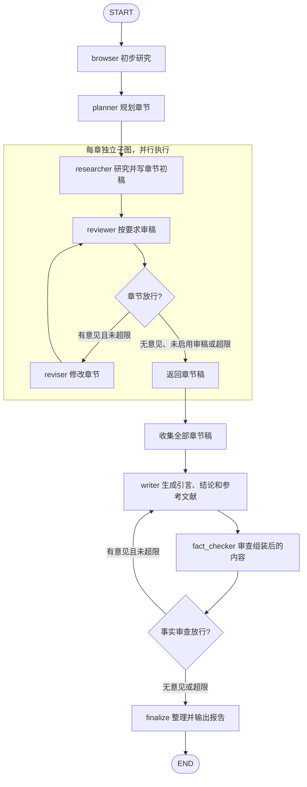

# GPT Researcher 研究与核验状态机

将 GPT Researcher 的 `multi_agents` 原生 LangGraph 工作流简化为设计参考：**初步研究 → 分章研究与审稿 → 汇总写作 → 事实审查与返修 → 输出报告**。这里调研的是多代理工作流，不代表普通 `GPTResearcher` SDK 每次研究都会执行这张图。

基于 2026-10-05 获取的官方默认分支 `main`，提交 `0957c301ed06c2a5857b834358c7227c739041d4`。以下区分源码行为与设计建议；未运行模型、安装依赖或接入本项目。

## 1. 图结构

外层 `researcher` 实际由 `EditorAgent` 启动多个章节子图，通过 `asyncio.gather` 收集结果。图中省略可选的人工计划返工；`join` 是收集动作，`finalize` 合并原生 `visualizer → publisher`，二者不是源码中的同名节点。[参考 1、2]

## 2. State

**本项目对外接口已固定**：输入为完整的 `claims: list[Claim]` 和 `context: VerificationContext`，由子图自行选择主张；完成时返回包含 `result: SubgraphResult` 的状态。接入时在子图内部由主张和上下文生成 `task`，出口按 `claim_id` 整理为 `ClaimFinding` 与 `Evidence`。协议见 [SubgraphState](../../backend/verification/state.py) 和 [结果模型](../../backend/verification/models.py)。

下表保留的是 **GPT Researcher 自身工作流的内部字段**；其外层 `ResearchState` 与各章 `DraftState` 分开保存，章节完成后仅把 `draft` 收集到外层 `research_data`。[参考 1—4]

| 所属 | 字段 | 内容与写入方 |
| --- | --- | --- |
| 外层 | `task` | 调用方提供问题、模型、审稿要求及迭代上限 |
| 外层 | `initial_research` | `browser` 生成的初步研究报告 |
| 外层 | `title`、`sections` | `planner` 生成的标题与章节计划 |
| 外层 | `research_data` | 章节子图完成后的稿件列表 |
| 外层 | `introduction`、`conclusion`、`sources` | `writer` 生成的引言、结论与来源链接；不是结构化证据库 |
| 外层 | `fact_check_notes`、`fact_check_revision_count` | `fact_checker` 的问题文本与累计退回次数 |
| 外层 | `report` | `publisher` 组装的最终报告 |
| 章节 | `topic`、`sibling_sections` | 当前研究主题及其他章节主题 |
| 章节 | `draft` | `researcher` / `reviser` 生成的 `{章节主题: 正文}` |
| 章节 | `review`、`revision_notes` | 审稿意见与返修说明 |
| 章节 | `draft_revision_count` | `reviewer` 累计提出返修的次数 |

GPT Researcher 原生图以 `{"task": task}` 启动；这是内部研究模块的调用形式，不改变本项目子图的输入输出。每章再传入主题和其他章节信息，拥有独立状态，完成后集中收集，外层不靠共享 State 的追加 reducer 合并稿件。

## 3. 节点职责

| 节点 | 执行与写回 |
| --- | --- |
| `browser` | 对总问题执行 `conduct_research()`，随后 `write_report()`，得到初步研究报告 |
| `planner` | 根据初步报告规划章节，写入标题与 `sections` |
| 章节 `researcher` | 每章执行研究与报告生成，得到章节初稿；这里发生实际取证 |
| `reviewer` | 按 `task.guidelines` 检查章节稿，返回问题或无意见；受 `follow_guidelines` 控制 |
| `reviser` | 根据现有稿件和审稿意见修改文本，再交回 `reviewer`；不调用研究工具 |
| `writer` | 基于各章稿件生成引言、结论、目录和来源列表；收到事实审查意见后再次生成这些内容 |
| `fact_checker` | 把引言、各章稿件、结论交给模型，要求指出事实错误、幻觉和不一致；只返回问题文本或 `None` |
| `finalize` | 代表原生的可视化与报告组装输出，不增加新的事实判定 |

**两层审查都没有自动补搜回边。** `fact_checker` 不访问网页或独立证据库；退回 `writer` 也不会重新研究或修改 `research_data` 中的章节正文，只要求修订引言、结论等内容。[参考 2—4]

## 4. 判定与结束条件

- 章节审稿只在 `follow_guidelines` 为真时调用模型；示例任务默认关闭。外层 `fact_checker` 固定接在 `writer` 后，没有对应的关闭开关。[参考 1、4]
- 正常模型响应在规范化后恰为字符串 `None` 时表示无意见，其余文本作为返修意见；这不是逐条主张的真伪标签，也没有 `claim_id → source_id` 的证据对齐。[参考 3]
- 两层返修上限默认均为 3；前三次提出意见会返修，第四次仍有意见时，图路由捕获超限异常并放行。**到达输出节点不等于核验通过。** 上限设为 `None` 只取消此计数限制，仍可能触发 LangGraph 的递归限制。[参考 1、2、5]
- 错误处理存在缺口：章节研究异常可被转换为 `{topic: None}`；`call_model` 捕获异常后隐式返回 Python `None`，事实检查器会写入 `fact_check_notes=None`，路由因此可能把调用失败当作无意见放行。[参考 3—5]

用于自己的设计时，建议保留这两个循环的职责划分，并补充以下约定；这些不是上游现有保证：

- 给事实核验增加明确的证据输入；需要新材料时路由回 `research`，需要修改章节时路由到相应章节。
- 将 `passed`、`revision_limit_reached`、`failed` 分开记录；模型空输出和工具异常进入失败处理。
- 若目标是逐条核验，沿用本项目输入的 `claims`，按 `claim_id` 关联内部证据和判定，再写入 `SubgraphResult.findings`；模型未提出意见不等于所有主张已获证实。

## 5. 参考入口

以下均固定到上述提交；各项按实现职责分组：

1. [外层图与事实返修路由](https://github.com/assafelovic/gpt-researcher/blob/0957c301ed06c2a5857b834358c7227c739041d4/multi_agents/agents/orchestrator.py#L65-L135)。
2. [分章并行执行与审稿子图](https://github.com/assafelovic/gpt-researcher/blob/0957c301ed06c2a5857b834358c7227c739041d4/multi_agents/agents/editor.py#L57-L164)。
3. [事实审查输入与返回值](https://github.com/assafelovic/gpt-researcher/blob/0957c301ed06c2a5857b834358c7227c739041d4/multi_agents/agents/fact_checker.py#L10-L66)、[写作返修范围](https://github.com/assafelovic/gpt-researcher/blob/0957c301ed06c2a5857b834358c7227c739041d4/multi_agents/agents/writer.py#L32-L71)。
4. [研究调用与章节异常](https://github.com/assafelovic/gpt-researcher/blob/0957c301ed06c2a5857b834358c7227c739041d4/multi_agents/agents/researcher.py#L13-L66)、[章节审稿开关](https://github.com/assafelovic/gpt-researcher/blob/0957c301ed06c2a5857b834358c7227c739041d4/multi_agents/agents/reviewer.py#L68-L87)、[示例任务](https://github.com/assafelovic/gpt-researcher/blob/0957c301ed06c2a5857b834358c7227c739041d4/multi_agents/task.json#L1-L19)。
5. [事实返修计数](https://github.com/assafelovic/gpt-researcher/blob/0957c301ed06c2a5857b834358c7227c739041d4/multi_agents/agents/fact_review.py#L1-L23)、[章节返修计数](https://github.com/assafelovic/gpt-researcher/blob/0957c301ed06c2a5857b834358c7227c739041d4/multi_agents/agents/draft_review.py#L1-L31)、[模型调用异常处理](https://github.com/assafelovic/gpt-researcher/blob/0957c301ed06c2a5857b834358c7227c739041d4/multi_agents/agents/utils/llms.py#L10-L36)。
