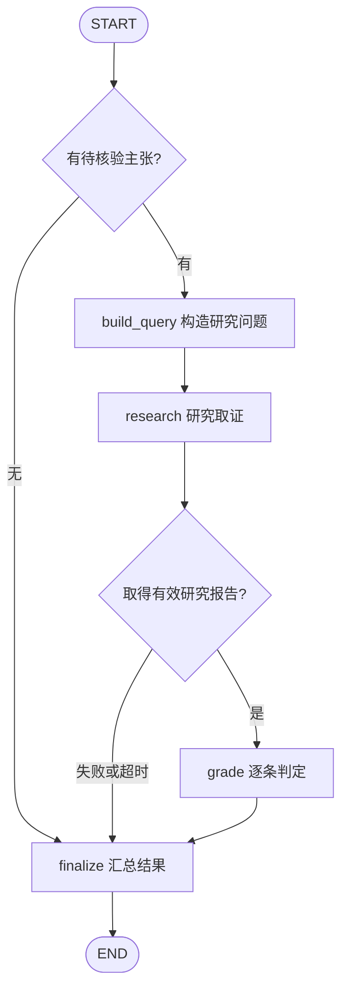

# Research 核验状态机

将 LDR 的“合并主张进行研究，再根据报告逐条判定”抽象为一个 LangGraph 子图，供后续设计参考。输入是已经提取的主张；`research` 内部如何检索、调用工具和生成报告，由具体实现决定。

这是设计草图，不是 LDR 原生的图定义，也不是本项目已实现的功能。不需要引入 LDR 依赖。

## 1. 图结构

菱形表示条件边的路由函数，不需要单独建节点。主流程共享一次研究结果，再分别输出每条主张的结论；`research` 内部可以多轮检索，外层没有判定后自动补搜的回边。

## 2. State

**对外接口已固定**：[SubgraphState](../../backend/verification/state.py) 的输入为完整的 `claims: list[Claim]` 和 `context: VerificationContext`，由子图自行选择主张；完成时必须返回包含 `result: SubgraphResult` 的状态。下表中的研究问题、报告、引用编号和判定均为内部中间数据。

| 字段 | 内容 | 写入方 |
| --- | --- | --- |
| `claims` | 主图传入的完整 `Claim` 列表，保留 ID、类型、内容和原始来源 | 主图 |
| `context` | 既有 `VerificationContext`：地点、核验时间、可选地点解析结果 | 主图 |
| `query` | 要求寻找支持材料和反证的研究问题 | `build_query` |
| `report` | 研究报告，保留与来源对应的引用 | `research` |
| `sources` | 来源列表：`source_id`、`title`、`url`、`content` | `research` |
| `verdicts` | 逐条判定：`claim_id`、`verdict`、`reasoning`、`source_ids` | `grade` |
| `error` | 研究或判定的执行错误；正常时为空 | `research` / `grade` |
| `result` | 既有 `SubgraphResult`：子图名称、执行状态、选中主张、发现、备注与错误 | `finalize` |

初始 State 只需提供 `claims`、`context`，其余字段使用空值。每个节点返回它更新的字段；这张图顺序执行，暂不需要并行合并 reducer。模型客户端、搜索工具和超时配置通过 runtime context 注入。

## 3. 节点职责

| 节点 | 读取 | 执行与写回 |
| --- | --- | --- |
| `build_query` | `claims`、`context` | 合并主张，明确地点、时间和需要验证的条件，写入 `query` |
| `research` | `query` | 调用研究能力收集材料，写入 `report`、`sources`；执行失败或超时则写入 `error` |
| `grade` | `claims`、`report`、`sources` | 根据报告批量判定主张，用 `claim_id` 对齐结果，校验引用属于已知来源，写入 `verdicts`；调用或解析失败则写入 `error` |
| `finalize` | 主张、判定、来源、错误 | 无主张则输出 `skipped`；有执行错误则输出 `failed`；其余输出 `completed`，同时保留已有材料 |

`research` 没有取得有效报告时，记录错误并进入 `finalize`，不继续调用判定节点。`grade` 的成功与失败都进入 `finalize`，由 `error` 区分。

## 4. 判定与结束条件

| `verdict` | 含义 |
| --- | --- |
| `supported` | 有证据支持主张 |
| `contradicted` | 有证据反驳主张 |
| `partially_supported` | 只支持部分内容，或存在适用条件 |
| `unverified` | 现有证据不足以判断 |

设计时保留以下约束：

- 每条判定必须对应输入中的 `claim_id`，引用必须指向已有 `source_id`。
- 判定理由要说明材料如何支持或反驳主张；引用编号合法不等于来源内容足以支持结论。
- 有效研究中某条主张缺少证据，可以返回 `unverified`；工具异常、超时、模型输出无法解析应记录执行错误。
- `completed` 只表示核验流程执行完成，不表示所有主张都得到支持。
- 为研究和判定分配共同的截止时间，并为汇总预留时间；本项目目前子图默认预算为 180 秒。

`finalize` 将内部判定映射为 `ClaimFinding(claim_id, summary, evidence)`，证据映射为 `Evidence(source, content, url)`，并填入 `SubgraphResult`。`selected_claim_ids` 必须来自输入，所有发现必须关联已选主张；`graph_name` 必须等于注册名称。`verdict`、`source_id` 可在内部使用，当前对外模型没有这些独立字段。

## 5. 参考入口

本草图基于 2026-10-05 阅读的 LDR 提交 `41a8bc9`，保留两个源码入口即可：

- [核验流程：启动一次研究，完成后调用判定](https://github.com/LearningCircuit/local-deep-research/blob/41a8bc9b278ca100fbd80af19a8070da90b62ba5/src/local_deep_research/web/static/js/pages/note-detail.js#L3145-L3365)。
- [合成研究问题与批量判定](https://github.com/LearningCircuit/local-deep-research/blob/41a8bc9b278ca100fbd80af19a8070da90b62ba5/src/local_deep_research/research_library/notes/services/note_ai_service.py#L909-L1187)。

本项目接口：[结果模型](../../backend/verification/models.py)、[运行时能力与预算](../../backend/verification/capabilities.py)。
